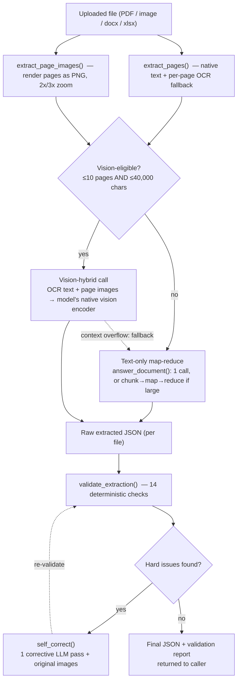

# `/v1/extract` — Vision Encoding, OCR & Invoice-to-JSON: Input to Output

One file, one endpoint, one question: **what exactly happens between the moment a document is uploaded and the moment structured JSON comes back?**

All facts below are read directly from the live `gateway/main.py`, with line numbers.

---

## The pipeline, end to end



---

## Stage 1 — Text extraction: `extract_pages()` (`main.py:475`)

Every uploaded file is first turned into plain text, page by page, dispatched by file extension:

- **PDF**: PyMuPDF (`fitz`) reads the *native* text layer of each page first — this is free, instant, and perfectly accurate when the PDF was digitally generated (not scanned).
- **Any page with under 300 characters of native text is treated as suspect** — it's rendered to a PNG at 2× zoom and sent to OCR. Whichever of {native text, OCR text} is **longer wins, per page** (not per document). This catches the common real-world case of a mostly-digital PDF where one page is a scanned attachment, and also catches a page that has a small amount of native text (a routing stamp, a header) while its actual content — a table — is only present as an image the text layer can't see at all. An earlier, lower threshold used to let such pages through untouched, silently dropping entire tables.
- **Images** (png/jpg/jpeg/webp/bmp/tiff) go straight to OCR.
- **docx** — parsed with `python-docx`, paragraphs plus tables (rows joined with `|`).
- **xlsx/xls** — parsed with `pandas`, each sheet converted to CSV text, treated as one "page."
- **txt/csv/other** — decoded as UTF-8, split into ~10,000-character pseudo-pages.

## Stage 2 — OCR itself: `ocr_image()` (`main.py:461`)

A blocking HTTP call to the **isolated OCR microservice** (PaddleOCR, its own process on port 7780, its own virtualenv). Isolation matters: an OCR crash or hang never takes the main gateway process down with it. On any failure (timeout, service down, bad image), `ocr_image()` returns an **empty string** rather than raising — the pipeline degrades gracefully (a page with no readable text is not a fatal document error).

## Stage 3 — Page image rendering: `extract_page_images()` (`main.py:542`)

In parallel with text extraction, every page is *also* rendered as a raw image (PNG) — this is what feeds the vision encoder in Stage 4. Zoom level adapts to page content: pages that look like dense tables (many short lines — exactly where small-print decimal digits get misread) render at **3× zoom**; everything else at the standard **2×**.

## Stage 4 — The vision-eligibility decision

```python
use_vision = bool(images) and len(images) <= MAX_VISION_PAGES and len(doc_text) <= SINGLE_SHOT_CHARS
# MAX_VISION_PAGES = 10 pages, SINGLE_SHOT_CHARS = 40,000 characters
```

Only small, simple documents take the vision path — larger ones would make vision too token-expensive, so they fall back to text-only processing (Stage 5b).

### Stage 5a — Vision-hybrid path (`_vision_doc_messages()`, `main.py:898`)

This is the heart of "vision encoding" in this system. The underlying model — `Qwen3.6-35B-A3B`, the same one behind every endpoint — has a **native multimodal vision encoder built into its weights** (a 27-layer vision transformer, hidden size 1152, 16×16 patches), not a bolted-on separate OCR-to-text service. The gateway sends the model **both** the OCR/native text **and** the actual page image(s) in the same chat message, exactly the way OpenAI's vision API accepts an `image_url` content part alongside text.

Why send both instead of just the image, or just the text? Because they cover different failure modes:
- OCR/native text alone can misread a character (a `0` as an `O`, a smudged `5` as a `6`) with no way to double check.
- The image alone requires the model to read everything visually, which is slower and more failure-prone for large blocks of a dense invoice.
- **Together**, the model can use the OCR text as its primary read and cross-check any digit it's unsure about against the literal pixels — and it can see things OCR text can never represent at all: logos, stamps, seals, handwriting, layout/table structure.

If sending images pushes the request over the model's context window anyway (image tokens aren't counted by the plain-text character budget, so this can still happen even for an "eligible" document), the pipeline **automatically falls back** to the text-only path below rather than failing the request outright — visible in the response as a strategy suffixed `_after_vision_overflow`.

### Stage 5b — Text-only path (`answer_document()`, `main.py:948`)

For anything not vision-eligible:
- **≤ 40,000 characters** → one single LLM call with the whole document as plain text.
- **> 40,000 characters** → **map-reduce**: `_chunk_pages()` (`main.py:877`) splits the document into chunks of ≤35,000 characters; `_map_chunks()` (`main.py:919`) sends each chunk to the LLM in parallel (concurrency 4), each one told to cite page numbers and answer "NOT FOUND" rather than guess; the partial answers are then combined hierarchically in groups of 5 until short enough for one final combining call via `_llm_retry_truncation()` (`main.py:850`, which also handles output-truncation retries).

## Stage 6 — Raw JSON, self-consistency (if requested)

The LLM's raw text response is parsed as JSON (`_try_json()`). If the caller requested `consistency > 1`, this whole extraction (Stage 4–6) runs **N times in parallel**, and the N JSON samples are merged (`_merge_by_vote()`, `main.py:2026`): same-shaped samples are deep-merged by **majority vote per field**; differently-shaped samples are **not** blindly unioned (to avoid two contradictory values for one fact surviving under two different field names) — instead the single sample with the fewest validation issues is kept.

## Stage 7 — Deterministic validation: `validate_extraction()` (`main.py:2144`)

Regardless of how confident the model sounded, **14 independent, code-based checks** run against the JSON before anyone trusts it:

| # | Check | What it catches |
|---|---|---|
| 1 | `not_json` | Output wasn't valid JSON |
| 2 | `empty_line_item` | A row with no description, quantity, price, or amount |
| 3 | `wrong_amount` | `quantity × unit_price ≠ amount` (exempting subscription/period billing) |
| 4 | `wrong_column` | A numeric field holds text, or vice versa — likely a column shift |
| 5 | `duplicate_row` | Identical item/description/amount repeated — a common map-reduce artifact |
| 6 | `total_mismatch` | Line items don't sum to the subtotal, or subtotal+tax ≠ total |
| 7 | `subtotal_as_line_item` | A row's amount equals the subtotal — likely the subtotal leaking in as a fake line |
| 8 | `vendor_missing` | Vendor name detected in source text, absent from output |
| 9 | `buyer_missing` | Buyer/bill-to detected in source, absent from output |
| 10 | `invoice_date_missing` | Same, for invoice date |
| 11 | `due_date_missing` | Same, for due date |
| 12 | `invoice_number_missing` | No invoice number in the output |
| 13 | `currency_missing` | Soft — no currency indicated |
| 14 | `missing_row` | Heuristic — a code/value pattern in source text with no matching output row |

## Stage 8 — Self-correction loop: `_self_correct()` (`main.py:2331`)

Any **hard** issue from Stage 7 triggers exactly **one** automatic correction call: the model is given the original document (plus the original page images, if the vision path was used) and the precise list of what's wrong, and asked to fix it. The corrected output is run back through `validate_extraction()` (the loop in the diagram above) so the final response always reflects the *post-correction* state, and reports whether correction actually happened (`validation.corrected`).

## Stage 9 — Output

```json
{
  "filename": "invoice.pdf",
  "pages": 1,
  "strategy": "vision_hybrid",
  "answer": "{\"invoice_no\": \"...\", \"total_amount\": \"...\", \"line_items\": [...]}",
  "validation": { "ok": true, "issues": [], "corrected": false }
}
```

`strategy` tells you exactly which route the document took: `vision_hybrid`, `single_pass`, `map_reduce`, with a `+consistency{N}` suffix if voting was used, or `_after_vision_overflow` if vision was attempted and fell back. This is the field to check first when debugging why one document's output looks different from another's.

---

## Invoice-to-JSON: what makes this specific to invoices

The extraction prompt (`EXTRACTION_RULES`, `main.py:612–802`) is written specifically for invoice-shaped documents:

- **Row-count self-check** — the model must state "Row count: N" before the JSON, making truncated output visibly wrong even before Stage 7 runs.
- **Line-item purity** — a row belongs in `line_items` only if it has its own item code, quantity, or unit price; a subtotal/tax/note row must go elsewhere (mechanically enforced afterward by checks 2 and 7 above).
- **Multi-line description joining** with `/`, never truncating wrapped text.
- **Vendor/buyer separation** on documents with multiple printed addresses.
- **Primary invoice-number/date disambiguation** from PO numbers, job numbers, routing numbers, or an approval-email date on the same page.
- **OCR character-confusion awareness** (`0`/`O`, `1`/`l`/`I`, `5`/`S`, `8`/`B`) — treated as genuinely ambiguous rather than confidently guessed, which is exactly what the vision-hybrid image cross-check (Stage 5a) exists to resolve.

Measured on the last 100 real production calls: 0% hard errors, 81% pass every check on the first try, 19% flagged (mostly `total_mismatch` / `invoice_number_missing`) — the large majority resolved automatically by Stage 8.
